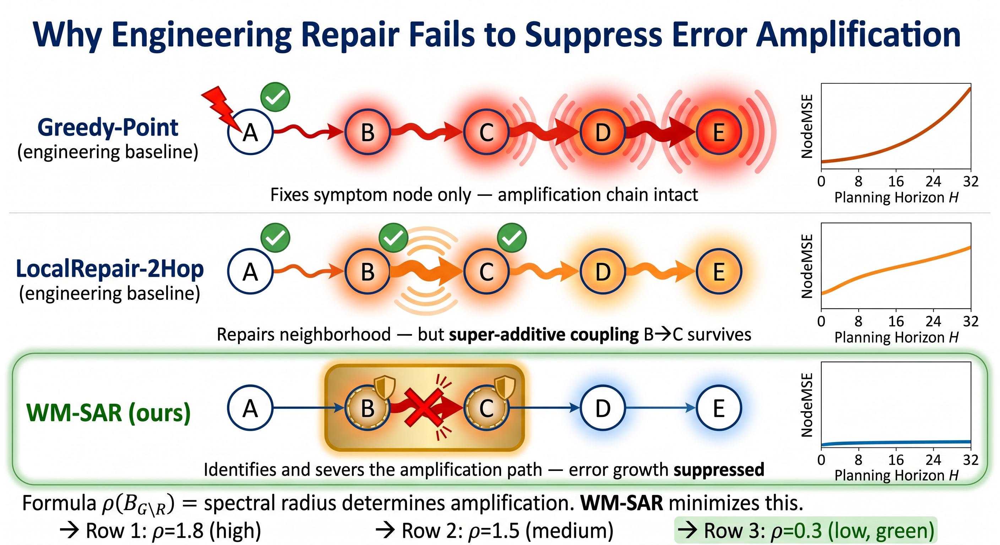

# WM-SAR: Subgraph Amplification Repair for Failed Agent Rollouts

<p align="center">
  <a href="#quick-start"></a>
  <a href="#intuition"></a>
  <a href="#running-experiments"></a>
  <a href="#api-reference"></a>
  <a href="#citation"></a>
</p>

<p align="center">
  
  
  
  
</p>

## Intuition

<p align="center">
  
</p>

Pointwise and shallow local repairs can fix visible symptom nodes while leaving the amplification path intact. WM-SAR targets the connected subgraph that drives error growth, suppressing the spectral amplification term rather than only patching local symptoms.

## Overview

WM-SAR is a graph-based framework for diagnosing and repairing failed agent and world-model rollouts. It converts a failed rollout into a *failure graph*, computes the Graph Error Amplification Factor (GEAF) via spectral analysis to identify which region of the graph amplifies errors most strongly, and extracts a connected subgraph repair region using a seed–grow–prune algorithm — enabling simultaneous, context-efficient repair of all affected steps rather than expensive pointwise scanning.

## Highlights

- Converts failed agent/world-model rollouts into directed failure graphs.
- Computes GEAF with spectral/random-walk amplification scores.
- Extracts compact connected repair regions with seed-grow-prune search.
- Compares WM-SAR against greedy point, local k-hop, window repair, and LLM baselines.
- Runs core simulation experiments without API keys; OpenAI/Gemini keys are needed only for optional LLM experiments.

## Requirements

```bash
pip install -r requirements.txt
```

Dependencies:
- `numpy>=1.24`
- `scipy>=1.10`
- `networkx>=3.0`
- `openai>=1.0` (for LLM experiments only)
- `google-genai>=1.0` (for Gemini experiments only)

Tested with Python 3.13.7.

## Quick Start

```python
from wm_sar import data_generator as dg, failure_graph as fg, baselines as bl, repair_executor as re_

# 1. Generate a synthetic agent rollout with a planted root-cause failure
rollout = dg.generate_agent_wm_rollouts(n=1, seed=42)[0]

# 2. Build the failure graph
G = fg.agent_rollout_to_graph(rollout)
print(f"Failure graph: {G.number_of_nodes()} nodes, {G.number_of_edges()} edges")

# 3. Run WM-SAR region extraction
plan = bl.wm_sar(G)          # returns a RepairPlan
print(f"Region: {len(plan.nodes)} nodes, token cost: {plan.token_cost}")

# 4. Measure recovery
rec = re_.measure_recovery(G, plan.nodes)
print(f"Recovered: {rec['recovered']}, IoU: {rec['region_iou']:.3f}")

# 5. Compare all baselines at once
all_plans = bl.all_baselines(G, budget=6)
for name, p in sorted(all_plans.items()):
    r = re_.measure_recovery(G, p.nodes)
    print(f"{name:<30} rec={r['recovered']}  cost={p.token_cost}")
```

## Running Experiments

### Non-LLM experiments (no API key needed)

```bash
python experiments/exp_agent.py           # Main simulation (n=50, seed=42)
python experiments/exp_benchmarks.py      # Benchmark topology generalisation
python experiments/exp_budget.py          # Budget efficiency
python experiments/exp_cascade_gain.py    # Cascade gain robustness
python experiments/run_all.py             # Run all non-LLM experiments
```

Legacy spec-aligned experiments (n=200):
```bash
python experiments/exp1_agent_wm_repair.py
python experiments/exp2_parametric_gwm_repair.py
python experiments/exp3_subgraph_vs_pointwise.py
python experiments/exp4_spectral_reduction.py
python experiments/exp5_context_limited.py
python experiments/exp6_ablation.py
```

### LLM experiments (requires API key)

```bash
export OPENAI_API_KEY="your-key-here"
export GEMINI_API_KEY="your-key-here"    # optional, for Gemini models

python experiments/exp_agent_llm.py      # LLM repair experiment (n=20)
python experiments/exp_multiapi.py       # Multi-API comparison
```

### Real attribution experiment (requires Who&When dataset)

```bash
# Download the Who&When dataset (Kevin355/Who_and_When on HuggingFace)
python experiments/exp_real_attribution.py \
    --data-dir /path/to/who_and_when_dataset/Algorithm-Generated \
    --n 20
```

All results are saved as JSON to `experiments/results/`.

## Repository Structure

```text
.
|-- figures/
|   `-- intuition.png       # README intuition figure
|-- experiments/            # Non-LLM, LLM, budget, benchmark, and ablation experiments
|-- wm_sar/
|   |-- __init__.py         # Package exports
|   |-- amplification.py    # GEAF spectral computations
|   |-- baselines.py        # Baseline methods + wm_sar() entry point
|   |-- benchmark_graphs.py # Benchmark topology generators
|   |-- data_generator.py   # Synthetic rollout generator
|   |-- failure_graph.py    # Rollout-to-failure-graph builder
|   |-- llm_baselines.py    # LLM-based repair baselines
|   |-- llm_client.py       # OpenAI/Gemini client; reads env vars
|   |-- metrics.py          # Recovery, CostNorm, IoU, rho_reduction metrics
|   |-- region_extractor.py # WMSAR class and WMSARConfig
|   |-- repair_executor.py  # Repair simulation and measurement
|   |-- act_text.py         # Text representation for LLM contexts
|   `-- text_scenarios.py   # Textual failure scenario generators
|-- requirements.txt
`-- README.md
```

## API Reference

### `WMSARConfig`

```python
from wm_sar.region_extractor import WMSARConfig

cfg = WMSARConfig(
    H=4,                 # Spectral random-walk depth (robust: H=1..16 all equivalent)
    max_region_size=20,  # Max nodes in repair region
    n_seeds=3,           # Initial seed nodes
    lambda1=1.0,         # Error coverage weight
    lambda2=0.5,         # Uncertainty weight
    lambda3=0.3,         # Target amplification weight
    merge_tau=0.1,       # BFS grow expansion threshold
    use_target=True,     # Enable target amplification scoring
    use_coupling=True,   # Enable boundary coupling term ρ(B_R)
    use_uncertainty=True,# Enable uncertainty weighting
    use_growing=True,    # Enable BFS region growing (critical component)
    use_pruning=True,    # Enable region pruning
)
```

### `WMSAR.repair_region(G)`

```python
from wm_sar.region_extractor import WMSAR, WMSARConfig
import networkx as nx

extractor = WMSAR(WMSARConfig())
region: set[str] = extractor.repair_region(G)  # returns set of node IDs
```

Input graph `G` is an `nx.DiGraph` where each node has attributes:
- `err` (float): observable error signal at this node
- `state` (np.ndarray, optional): 8-dim state vector
- `uncertainty` (float, optional): prediction uncertainty

### `run_all_baselines(G, budget=6)`

```python
from wm_sar.baselines import all_baselines

plans = all_baselines(G, budget=6)
# plans: dict[str, RepairPlan]
# RepairPlan.nodes: set of node IDs in the repair region
# RepairPlan.token_cost: estimated token cost
```

### Building a failure graph from your own rollout

```python
from wm_sar.failure_graph import agent_rollout_to_graph
# rollout: dict with keys 'steps', 'root_cause_t', 'gt_region_steps', etc.
# (see data_generator.py for the full schema)
G = agent_rollout_to_graph(rollout)
```

## Citation

```
@article{wmsar2025,
  title   = {WM-SAR: Subgraph Amplification Repair for Failed Agent Rollouts},
  author  = {Anonymous},
  journal = {Under Review},
  year    = {2025}
}
```

*Paper under review. Citation will be updated upon publication.*

## License

MIT
